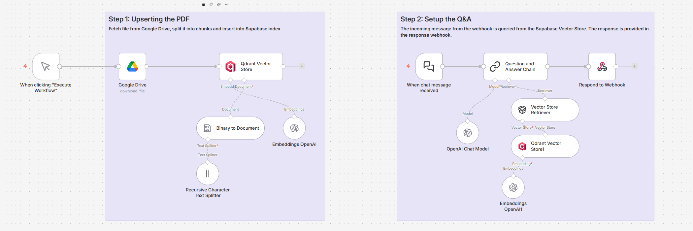
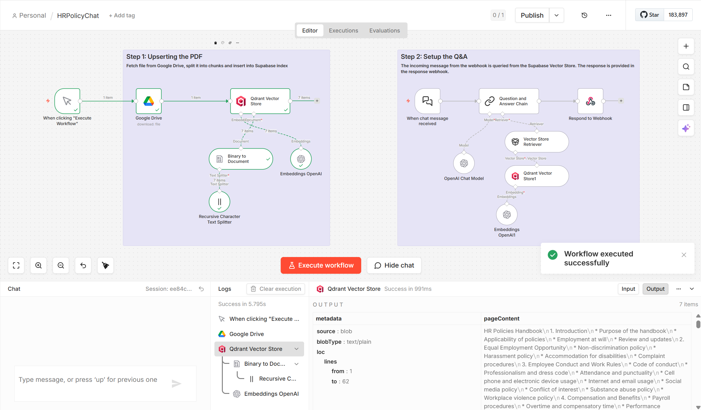
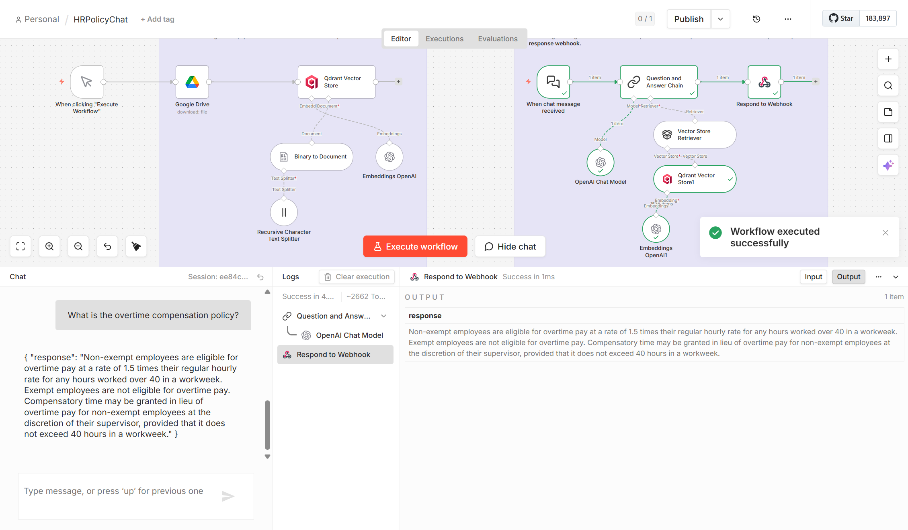

## 🤖📑 RAG Pattern — HR Policies Q&A

## 📌 Project Overview
This project demonstrates how to build a **chat interface with your document** using [n8n](https://n8n.io).  
It imports the **HR Policies Handbook** into a vector database, sets up embeddings and retrieval (RAG), and exposes a chat endpoint for interactive Q&A.

---

## 🧩 Pattern Insight
This workflow exemplifies the **RAG (Retrieval‑Augmented Generation) pattern**:  
- A document (HR Policies Handbook) is ingested and embedded into a vector store.  
- Queries are answered by combining **retrieval from Qdrant** with **generation from GPT‑4o‑mini**.  
- The result is a chat interface that provides grounded, document‑aware responses.  

This showcases how n8n can orchestrate a classical RAG pipeline, a widely adopted industry pattern for building reliable Q&A systems over enterprise knowledge bases.

---

## 🛠️ Tech Stack
- **n8n** — workflow orchestration
- **OpenAI GPT-4o-mini + text-embedding-3-small** — chat model + embeddings
- **Qdrant** — vector store
- **Google Drive** — document source

---

## 📁 Repository Structure

```
screenshots/                # Screenshot images used in README.md
HR+Policies+Handbook.txt    # HR Policies Handbook Document
HRPolicyChat.json           # Main n8n workflow for Upsert & RAG Q&A
README.md                   # Project documentation
```

---

## 🏗️ Architecture
Workflow steps:
1. **Document ingestion**: Fetch HR Policies Handbook from Google Drive.  
2. **Preprocessing**: Split text into chunks.  
3. **Embedding**: Generate embeddings with OpenAI.  
4. **Vector store**: Upsert into Qdrant.  
5. **Retrieval QA**: Query via RAG chain.  
6. **Chat interface**: Respond through webhook/chat.  

<div align="center">
  
  <p><em>Upsert and RAG Q&A Workflow Architecture</em></p>
</div>

---

## ⚙️ Setup Instructions
1. Clone this repo and import `HRPolicyChat.json` into n8n.  
2. Configure credentials:  
   - Google Drive access
   - Qdrant connection  
   - OpenAI API key    
3. Upload the HR Policies Handbook — `HR+Policies+Handbook.txt` to Google Drive.  
4. Execute workflow to upsert document into vector store.  

<div align="center">
  
  <p><em>Document Upsert Success</em></p>
</div>

---

## 🚀 Usage
- Trigger the workflow via webhook or manual chat.  
- Ask questions like:  
  - *“What is the overtime compensation policy?”*  
  - *“What is the company’s equal employment opportunity policy?”*  
  - *“How does the harassment policy work?”*  
  - *“What is the company’s dress code?”*  
  - *“What is the PTO policy, including number of days provided?”*  
  - *“What is the process for reporting misconduct?”*  

<div align="center">
  
  <p><em>Chat Interface Example</em></p>
</div>

---

## 🔮 Future Work
- Support multiple document sources.  
- Deploy the worflow to cloud (e.g. Railway.com).
- Integrate CI/CD for automated workflow updates.
- Add monitoring and logging for production use.  
